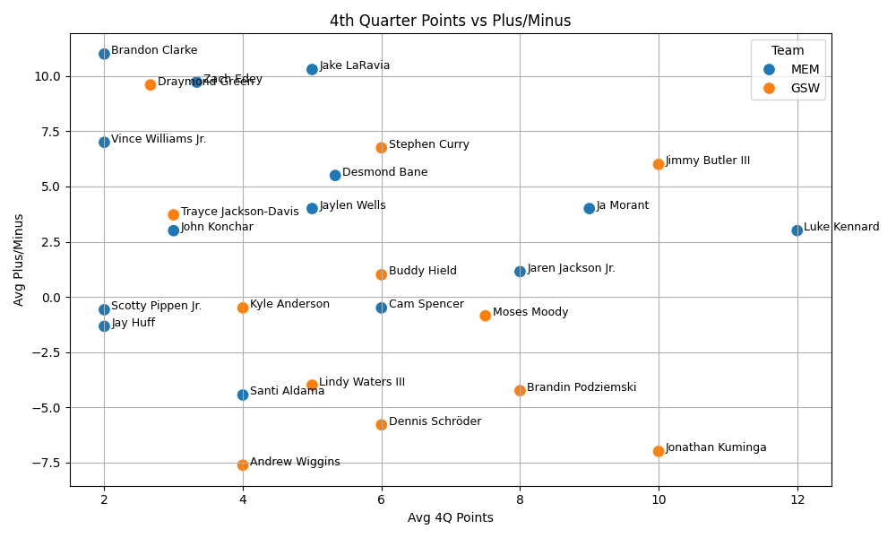

# 🏀 NBA Playoffs Matchup Analysis: GSW vs MEM & SAC vs DAL

This project analyzes recent performance trends of NBA teams and players in playin Tournament matchups using data from the `nba_api`. It focuses on two head-to-head comparisons:

- **Golden State Warriors vs Memphis Grizzlies**
- **Sacramento Kings vs Dallas Mavericks**

The goal is to understand which players are key contributors, especially in **4th quarters**, and how their impact correlates with team performance (+/- stats).
The reason for me to start this project is today is 2025/04/14 and tommorow is the first day pf the Play-in Tournament,I want to see who have a better chance to win and I want to give advise to the teams like there anaylsit and see the result after my prediction.


# 📊 Features

- Pulls **full season game logs** using `nba_api`
- Filters games where teams faced each other
- Extracts **quarter-wise player scoring** from Play-by-Play data
- Retrieves **plus/minus** stats from Box Scores
- Aggregates performance by:
  - Total points
  - Average points per game
  - Average points in **4th quarters**
  - Average +/- rating
- **Visualizes** key players by plotting:
  - `avg_4Q_pts` vs `avg_plus_minus`
  - Colored by team
  - With player name annotations

---

# 🛠 Tech Stack

- Python 🐍
- `nba_api`
- `pandas`
- `matplotlib` + `seaborn`

---
# The Analysis
## GSW VS MEM
### 1.Last 10 Games:
I look though the data from this season's team stats and filtered out the Warriors and Grizzlies' last 10 games.
```python
from nba_api.stats.static import teams
from nba_api.stats.endpoints import teamgamelog
import pandas as pd


team_names = ['Golden State Warriors', 'Memphis Grizzlies', 'Sacramento Kings', 'Dallas Mavericks']


all_teams = teams.get_teams()
team_ids = {team['full_name']: team['id'] for team in all_teams if team['full_name'] in team_names}


def get_last_10_games(team_id, team_name):
    gamelog = teamgamelog.TeamGameLog(team_id=team_id, season='2024-25', season_type_all_star='Regular Season')
    df = gamelog.get_data_frames()[0]
    df = df[['GAME_DATE', 'MATCHUP', 'WL', 'PTS', 'REB', 'AST']].head(10)
    df['TEAM'] = team_name
    return df


all_data = pd.concat([
    get_last_10_games(team_ids['Golden State Warriors'], 'Warriors'),
    get_last_10_games(team_ids['Memphis Grizzlies'], 'Grizzlies'),
    get_last_10_games(team_ids['Sacramento Kings'], 'Kings'),
    get_last_10_games(team_ids['Dallas Mavericks'], 'Mavericks')
])


print("Last 10 games stats：")
print(all_data)


print(all_data['MATCHUP'].unique())


summary = all_data.groupby(['TEAM', 'WL']).size().unstack(fill_value=0)
summary['WIN_RATE'] = summary['W'] / (summary['W'] + summary['L'])
print("\nWinRates：\n", summary)
```
The result I got is the list below:
```r
WinRates：
 WL         L  W  WIN_RATE
TEAM
Grizzlies  6  4       0.4
Warriors   3  7       0.7
```
- we can see that the Warriors have a better win_rate than the Grizzlies in the last 10 games of this season
---
### 2. Details in each games of their match up this season
 Here is the code I wrote to find out how there match up games turned out this season.
```python
from nba_api.stats.static import teams
from nba_api.stats.endpoints import teamgamelog
import pandas as pd
import matplotlib.pyplot as plt
import seaborn as sns


team_names = ['Golden State Warriors', 'Memphis Grizzlies', 'Sacramento Kings', 'Dallas Mavericks']


all_teams = teams.get_teams()
team_ids = {team['full_name']: team['id'] for team in all_teams if team['full_name'] in team_names}


def get_games(team_id, team_name):
    gamelog = teamgamelog.TeamGameLog(team_id=team_id, season='2024-25', season_type_all_star='Regular Season')
    df = gamelog.get_data_frames()[0]
    df = df[['GAME_DATE', 'MATCHUP', 'WL', 'PTS', 'REB', 'AST']]
    df['TEAM'] = team_name
    return df


# Concatenate data for all teams
all_data = pd.concat([
    get_games(team_ids['Golden State Warriors'], 'Warriors'),
    get_games(team_ids['Memphis Grizzlies'], 'Grizzlies'),
    get_games(team_ids['Sacramento Kings'], 'Kings'),
    get_games(team_ids['Dallas Mavericks'], 'Mavericks')
])

# Pivot the table so that TEAM is the header

gsw_vs_mem_data = all_data[all_data['MATCHUP'].str.contains(r'GSW.*MEM|MEM.*GSW')]


gsw_vs_mem_Wariorsdata = gsw_vs_mem_data[gsw_vs_mem_data['TEAM'] == 'Warriors']
gsw_vs_mem_Memphisdata = gsw_vs_mem_data[gsw_vs_mem_data['TEAM'] == 'Grizzlies']

Kings_vs_Mavs_data = all_data[all_data['MATCHUP'].str.contains(r'SAC.*DAL|DAL.*SAC')]
Kings_vs_Mavs_kingsdata = Kings_vs_Mavs_data[Kings_vs_Mavs_data['TEAM'] == 'Kings']
Kings_vs_Mavs_mavsdata = Kings_vs_Mavs_data[Kings_vs_Mavs_data['TEAM'] == 'Mavericks']


print("\nGSW vs MEM Data with TEAM as Header in all_data:")
print(gsw_vs_mem_Memphisdata)
print(gsw_vs_mem_Wariorsdata)
print("\nKings vs Mavs Data with TEAM as Header in all_data:")
print(Kings_vs_Mavs_kingsdata)
print(Kings_vs_Mavs_mavsdata)
```
the result:
```c
GSW vs MEM Data with TEAM as Header in all_data:
       GAME_DATE      MATCHUP WL  PTS  REB  AST       TEAM
6   APR 01, 2025  MEM vs. GSW  L  125   43   22  Grizzlies
46  JAN 04, 2025    MEM @ GSW  L  113   43   29  Grizzlies
54  DEC 19, 2024  MEM vs. GSW  W  144   60   38  Grizzlies
69  NOV 15, 2024    MEM @ GSW  L  118   54   22  Grizzlies
       GAME_DATE      MATCHUP WL  PTS  REB  AST      TEAM
7   APR 01, 2025    GSW @ MEM  W  134   49   29  Warriors
48  JAN 04, 2025  GSW vs. MEM  W  121   29   32  Warriors
56  DEC 19, 2024    GSW @ MEM  L   93   36   20  Warriors
70  NOV 15, 2024  GSW vs. MEM  W  123   56   33  Warriors
```
What I see from the chart above is that 
- Their score are pretty close so there is a big chance that they will play a very tight game from the first quarter to the end of the 4th.
- The Warriors can not stop the Grizzlies score, but the Grizzlies can't either. Their scores each games are high and the only lost for the Warriors was its score under 100 pts.
- The rebound can be a big problem for the Warriors but if they can secure their rebounds, they would have a better chance of winning, as for the Grizzlies,they can rebound pertty consistently comparing to the Warriors.
- Warriors is a better passing team overall, that requires the Grizzlies to be communicate more to have a succuessfull defence.
---
## 3. key players to watch
I showed the stats for the players from these 2 teams when they are playing aginst each other, since they are playing a win or go home game, it is really import thing to show who is taking over the 4th quarter for their team and  here is the code:
```python
from nba_api.stats.static import teams
from nba_api.stats.endpoints import teamgamelog, playbyplayv2, boxscoretraditionalv2
import pandas as pd
import time
import matplotlib.pyplot as plt
import seaborn as sns
# 1. Get team ID
team_id_gsw = teams.find_teams_by_full_name("Golden State Warriors")[0]['id']
season = '2024-25'

# 2. Get all Warriors games and filter GSW vs MEM
games = teamgamelog.TeamGameLog(team_id=team_id_gsw, season=season).get_data_frames()[0]
gsw_vs_mem = games[games['MATCHUP'].str.contains('MEM')]
game_ids = gsw_vs_mem['Game_ID'].tolist()

# 3. Get per-quarter points for each player
all_player_stats = []

for game_id in game_ids:
    pbp = playbyplayv2.PlayByPlayV2(game_id=game_id).get_data_frames()[0]

    points_events = pbp[pbp['EVENTMSGTYPE'].isin([1, 3])]
    points_events['PTS'] = points_events['EVENTMSGTYPE'].apply(lambda x: 2 if x == 1 else 1)
    points_events['PTS'] = points_events.apply(
        lambda row: 3 if row['EVENTMSGTYPE'] == 1 and '3PT' in str(row['HOMEDESCRIPTION']) else row['PTS'], axis=1
    )

    game_stats = points_events.groupby(['PERIOD', 'PLAYER1_NAME'])['PTS'].sum().reset_index()
    game_stats['GAME_ID'] = game_id
    all_player_stats.append(game_stats)
    
    time.sleep(0.6)

df = pd.concat(all_player_stats)

# 4. Get PLUS_MINUS and TEAM from box score
plus_minus_list = []

for game_id in game_ids:
    box = boxscoretraditionalv2.BoxScoreTraditionalV2(game_id=game_id)
    pm_df = box.get_data_frames()[0][['PLAYER_NAME', 'TEAM_ABBREVIATION', 'PLUS_MINUS']]
    pm_df['GAME_ID'] = game_id
    plus_minus_list.append(pm_df)
    
    time.sleep(0.6)

pm_df = pd.concat(plus_minus_list)

# 5. Merge scoring and plus-minus data
merged = df.merge(pm_df, left_on=['PLAYER1_NAME', 'GAME_ID'], right_on=['PLAYER_NAME', 'GAME_ID'], how='left')

# 6. Calculate avg 4th quarter points
q4 = merged[merged['PERIOD'] == 4]
avg_q4_pts = q4.groupby('PLAYER1_NAME')['PTS'].mean().reset_index()
avg_q4_pts.rename(columns={'PTS': 'avg_4Q_pts'}, inplace=True)

# 7. Full summary
summary = merged.groupby(['PLAYER1_NAME', 'TEAM_ABBREVIATION']).agg(
    total_pts=('PTS', 'sum'),
    avg_pts_per_game=('PTS', 'mean'),
    avg_plus_minus=('PLUS_MINUS', 'mean'),
    games_played=('GAME_ID', 'nunique')
).reset_index()

# 8. Merge 4th quarter points
summary = summary.merge(avg_q4_pts, on='PLAYER1_NAME', how='left')

# 9. Sort by impact
summary = summary.sort_values(by='avg_4Q_pts', ascending=False)
sum_GSW = summary[summary['TEAM_ABBREVIATION'] == 'GSW']
summary_MEM = summary[summary['TEAM_ABBREVIATION'] == 'MEM']
# 10. Display
print("\n🏀 Key Players vs MEM (GSW perspective):")
print(sum_GSW.head(10))
print(summary_MEM.head(10))

plt.figure(figsize=(10, 6))
sns.scatterplot(data=summary, x='avg_4Q_pts', y='avg_plus_minus', hue='TEAM_ABBREVIATION', s=100)

# Add player names as labels
for _, row in summary.iterrows():
    plt.text(row['avg_4Q_pts'] + 0.1, row['avg_plus_minus'], row['PLAYER1_NAME'], fontsize=9)

plt.title('4th Quarter Points vs Plus/Minus')
plt.xlabel('Avg 4Q Points')
plt.ylabel('Avg Plus/Minus')
plt.legend(title='Team')
plt.grid(True)
plt.tight_layout()
plt.show()
```
Here is the result:
```c
🏀 Key Players vs MEM (GSW perspective):
          PLAYER1_NAME TEAM_ABBREVIATION  total_pts  avg_pts_per_game  avg_plus_minus  games_played  avg_4Q_pts
15    Jimmy Butler III               GSW         26          6.500000        6.000000             1        10.0
17    Jonathan Kuminga               GSW         39          6.500000       -7.000000             3        10.0
1   Brandin Podziemski               GSW         39          4.875000       -4.250000             3         8.0
24         Moses Moody               GSW         33          4.714286       -0.857143             3         7.5
5      Dennis Schröder               GSW         25          5.000000       -5.800000             2         6.0
3          Buddy Hield               GSW         46          4.600000        1.000000             4         6.0
29       Stephen Curry               GSW         55          6.875000        6.750000             3         6.0
20    Lindy Waters III               GSW         26          5.200000       -4.000000             3         5.0
19       Kyle Anderson               GSW         24          3.000000       -0.500000             3         4.0
0       Andrew Wiggins               GSW         52          6.500000       -7.625000             3         4.0
         PLAYER1_NAME TEAM_ABBREVIATION  total_pts  avg_pts_per_game  avg_plus_minus  games_played  avg_4Q_pts
21       Luke Kennard               MEM         20          5.000000        3.000000             3   12.000000
10          Ja Morant               MEM         45          6.428571        4.000000             2    9.000000
12  Jaren Jackson Jr.               MEM         95          6.785714        1.142857             4    8.000000
4         Cam Spencer               MEM         12          6.000000       -0.500000             2    6.000000
6        Desmond Bane               MEM         72          5.142857        5.500000             4    5.333333
11       Jake LaRavia               MEM         43          4.300000       10.300000             3    5.000000
14       Jaylen Wells               MEM         41          4.100000        4.000000             4    5.000000
27       Santi Aldama               MEM         44          4.888889       -4.444444             3    4.000000
32          Zach Edey               MEM         38          3.454545        9.727273             4    3.333333
16       John Konchar               MEM          6          3.000000        3.000000             1    3.000000
```

- We can see from the chart that for the Warriors, Jimmy Buttler played well and scored 10 pts in the 4th quarter, but since he just joined the team, he only played againest the Grizzlies once with the Warriors, beside him, the first man with a possitive average +/- rate and with the most averge 4th quarter points is Steph Curry.
- For the Grizzlies, Luke Kennard, Ja Morant and Jaren Jackson JR are the 3 main key player to watch out in the 4th, Desmond Bane has the second most total Points and positive +/- rate and Avg 4Q_pts as well.
- From the Scatter plot above, we also see that Draymond Green has better +/- rate than both Steph and Jimmy. Zach Edey also having one of the highest +/- rate with Jake LaRavia from the Grizllies.
---
# Conclution and Suggestions
If the Warriors want to win the game
- the big 3 have to be the best of them selfs, watch out for Luke Kennard and Ja Morant because they can score alot in the 4th quarter
- since 4 of the players that are negetive +/- rates were traded
- the new roaster can be better against the Grizzlies as the Warriors won 7 out of the last 10.
- Secure the rebound.

If the Grizzlies want to win the game
- Do what ever you can top stop the big 3 of the Warriors making impact for their team.
- Give more time to the players that have better +/- rate since you have more players with that.
### Overall the Grizzlies recently just fired their head coach so it is a big impact, Warriors are 3-1 against the Grizzlies, Warriors have a better record the last 10 games, so I will Pick the Golden State Warriors to win this Playin Tournament.
------------


